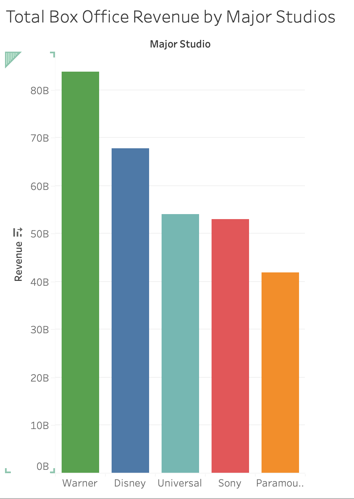
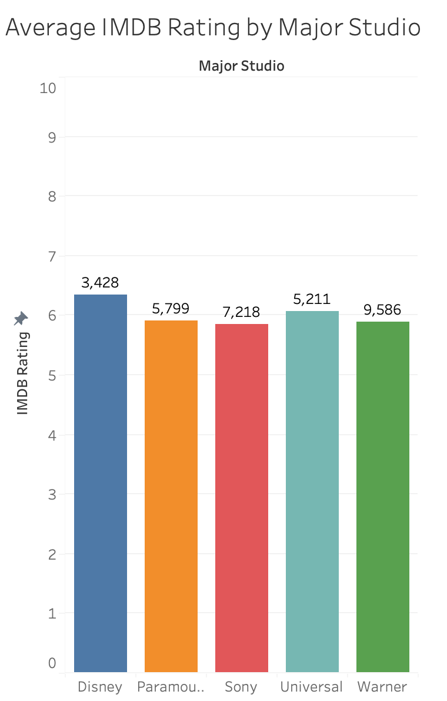

# Hollywood Major Studios Comparison Dashboard

Interactive Tableau Public dashboard comparing major Hollywood studios (**Sony Pictures, Disney, Warner Bros., Universal, Paramount**) on:

- Total Box Office Revenue  
- Average ROI (Budget ≥ $1M)  
- Revenue trends over years  
- Average IMDb Ratings  
- Genre Distribution

## Live Interactive Dashboard
[🔗 View the full interactive dashboard](https://public.tableau.com/views/HolywoodMajorStudiosDashboard-RevenueROIGenres/Dashboard1?:language=en-US&:sid=&:redirect=auth&:display_count=n&:origin=viz_share_link)

## Screenshots

.png)
.png)

## Download the Tableau Workbook
[📥 Download Hollywood Major Studios Dashboard.twbx](https://github.com/kfsh89/Hollywood-studios-tableau-dashboard/edit/main/README.md#:~:text=Holywood%20Major%20Studios-,Dashboard,-%2D%20Revenue%20ROI%20Genres.twbx)

*(After downloading, open the `.twbx` file with Tableau Public or Tableau Desktop to explore interactively)*

## Tools & Dataset
- **Tool**: Tableau Public  
- **Dataset**: Kaggle - The Movies Dataset (movies_metadata.csv)

Built as part of my **Entertainment Data Analytics** portfolio.  
Open to Summer 2026 internships in Film, Media, and Entertainment Analytics.
